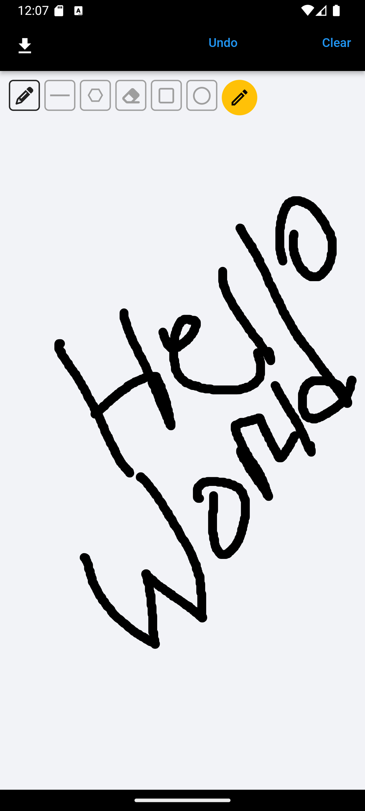
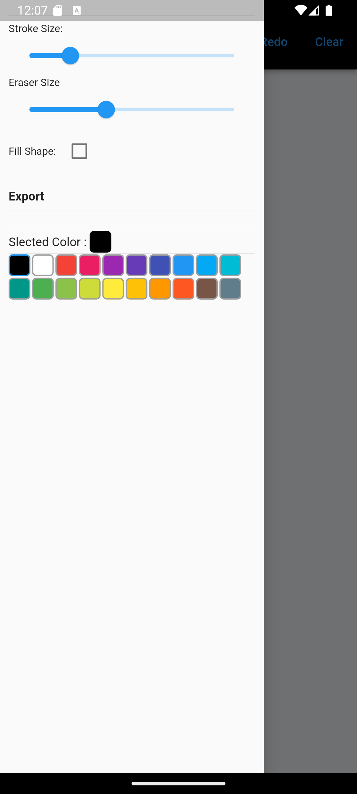

# Drawing Board task

A new Flutter project.

## Requirements

### Functional Requirements

- Canvas Area:
  The app should feature a canvas area where users can draw with their fingers.

- The canvas should support multiple stroke colors and stroke widths.
- The canvas should be responsive and support drawing on devices with -different screen sizes.
- Stroke Width Selection:
  Users should be able to choose different colors for the brush.
  Users should be able to adjust the stroke width.
- Undo/Redo Functionality:
  Implement undo and redo functionality to allow users to correct mistakes or revert to a previous state.
- Clear Canvas:
  Include a button to clear the canvas and start a new drawing.
- Download Drawing:
- Provide a button to download the current drawing on the canvas as an image file (e.g., PNG or JPEG) to the device's storage.

### Technical Requirements

- State Management:
  Use any state management approach (e.g., Provider, Riverpod, Bloc) to manage the state of the canvas, color selection, and stroke width.
- File Handling:
  Implement file handling for saving the canvas drawing to the device's storage. Ensure the app requests appropriate permissions for file access.
- Responsive Design:
  The app should be responsive and provide a consistent user experience across different device sizes.
  Non-functional Requirements
- Code Quality:
  The code should be well-organized, properly commented, and follow Dart and Flutter best practices.
  Include error handling and validation where appropriate.
- Documentation:
  Provide a README file with instructions on how to run the project, a brief overview of the app, and a description of the project structure.

## About Project

- Allows the user to Draw on a canvas
- Allows to save their Drawing
- Allows to select a width of the stoke and eraser size
- Allows Selection of different shapes and colors
- Allows Undo, Redo, Clear

## Unimplemented

- Selection of image type (jpg used)
- Did not use the required state management State management, Used: Flutter hooks( Better for this specific Application )

## Walktrough 
  [![Click Here]](https://drive.google.com/file/d/1kS3VOvgPmX9-5P34IdOD3GFWUNVEM5eY/view?usp=sharin)


## Screenshot




## How to install

Make sure you have Flutter and Android Studio installed locally on your device

- Clone Repository

```bash
Git clone  (Repo link)
```

- Open Cloned Repo to your editor
- Run the following commands on your terminal

```bash
flutter clean
flutter pub get
```

- Run your Android emulator or Apple simulator

- Run Project
